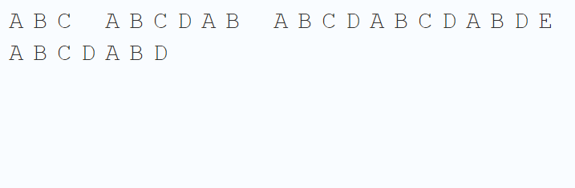
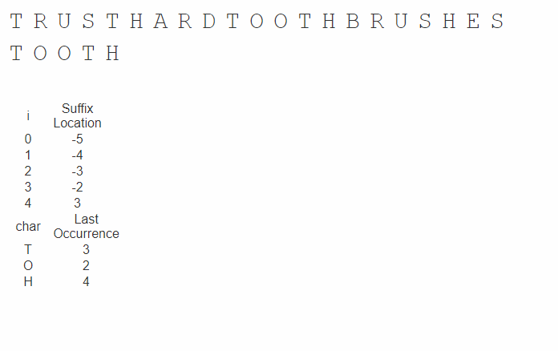

# Boyer Moore Horspool Algorithm

## First Step

문자열에서 일정한 규칙을 찾는것은 다양하게 사용할 수 있고 개발과정에서 자주, 쉽게 접할 수 있어요.  
또, 다양한 프로그램에서 많이 쓰이기도 합니다. 

그리고 그런 문자열 검색 알고리즘은 크누스-모리스-프랫 알고리즘, 보이어-무어-호스풀 알고리즘, 라빈-카프 알고리즘 등을 사용합니다.

## Naive string search visualize

BMH 알고리즘을 이야기 하기 전에 일반적인 문자열 검색을 이야기 하고 싶어요.  
일반적인 문자열 검색의 방법을 그림으로 보면 다음과 같아요.



## Naive string search code

```text
// C++ program for Naive Pattern 
// Searching algorithm 
#include <bits/stdc++.h> 
using namespace std; 
  
void search(char* pat, char* txt) 
{ 
    int M = strlen(pat); 
    int N = strlen(txt); 
  
    /* A loop to slide pat[] one by one */
    for (int i = 0; i <= N - M; i++) { 
        int j; 
  
        /* For current index i, check for pattern match */
        for (j = 0; j < M; j++) 
            if (txt[i + j] != pat[j]) 
                break; 
  
        if (j == M) // if pat[0...M-1] = txt[i, i+1, ...i+M-1] 
            cout << "Pattern found at index "
                 << i << endl; 
    } 
} 
  
// Driver Code 
int main() 
{ 
    char txt[] = "AABAACAADAABAAABAA"; 
    char pat[] = "AABA"; 
    search(pat, txt); 
    return 0; 
} 
  
// This code is contributed 
// by Akanksha Rai 
```

> Output  
> Pattern found at index 0  
> Pattern found at index 9   
> Pattern found at index 13

이처럼 Naive string search는 결과값을 얻는 가장 전통적인 방식이에요.   
하지만 이런 글자가 수십억개가 된다면? 하나하나 일일히 비교하려면 굉장히 많은 시간이 걸릴꺼에요.   
그래서 저는 BMH 알고리즘을 소개해보려고 해요.

## Boyer-Moore-Horspool search theory

BMH 알고리즘은 다음과 같은 문자열 계산 공식을 이용해 표를 만들어 사용합니다.   
**1. 검색 키워의 총 길이를 구한다.**   
=&gt; 예를 들어 TOOTH 라는 단어가 있다면 총길이는 5가 될꺼에요.  
  
**2. 검색할 키워드에서 존재하는 문자의 index로 이루어진 표로 만든다.**

| T | O | O | T | H |
| :--- | :--- | :--- | :--- | :--- |
| 0 | 1 | 2 | 3 | 4 |

**3. 해당 표에서 index를 \(총길이 -  index - 1\) 로 변경한다.**

| T | O | O | T | H |
| :--- | :--- | :--- | :--- | :--- |
| 4 | 3 | 2 | 1 | 0 |

**4. 표에서 마지막 문자와 키워드에 존재하지 않는 다른 문자는 키워의 총길이로 변경한다.** 

| T | O | O | T | H | \* |
| :--- | :--- | :--- | :--- | :--- | :--- |
| 4 | 3 | 2 | 1 | 5 | 5 |

**5. 만약 같은 문가 있다면 해당 문자의를 가장 작은 숫자로 기준을 잡는다.**

| T | O | H | \* |
| :--- | :--- | :--- | :--- |
| 1 | 2 | 5 | 5 |

**6. 이를 이용해서 순차적으로 문자가 일치하는지 확인하고 매치가 안된다면 표의 value 만큼 이동시킨다.**

즉 이 BMH 알고리즘은 매치가 되지 않았을때 현재 검색 index를 계산 공식만큼 이동시키는게 핵심이에요.

## BMH algorithm visualize



## BMH Algorithm code

위의 이론을 코드로 나타내면 아래와 같을꺼에요.

```text
//created by hyunjin.gil 
#include <bits/stdc++.h>

using namespace std;

string alphabets="ABCDEFGHIJKLMNOPQRSTUVWXYZ";

void initialize(map<char,unsigned int> & tables,const string & pattern)
{
    
    for(int i = 0; i < alphabets.size(); ++i)
    {
        const char ch = alphabets[i];
        tables[ch] = pattern.size();
    }
    
}

void makeTable(map<char,unsigned int> & tables, const string & pattern)
{
    //last index is pattern's length
    for(int i = pattern.size()-2; i >=0; --i)
    {
        const char ch = pattern[i];
        const int value = pattern.size() - i - 1;
        
        if(tables[ch] > value){
            tables[ch] = value;
        }
    }
}

int findString(const map<char, unsigned int>& tables, const string & pattern, const string & str)
{
    //TODO : BMH


    return -1;
}

int main() {
    
    const string pattern = "TOOTH";
    const string str = "TRUSTHARDTOOTHBRUSHES";
    
    map<char,unsigned int> tables;
    
    initialize(tables, pattern);
    makeTable(tables, pattern);
    int position = findString(tables, pattern, str);
    
    cout << position << endl;
    
    return 0;
}
```

##  

## Reference.



{% embed url="https://en.wikipedia.org/wiki/Boyer%E2%80%93Moore\_string\_search\_algorithm" caption="BMH Algorithm wikipedia " %}








