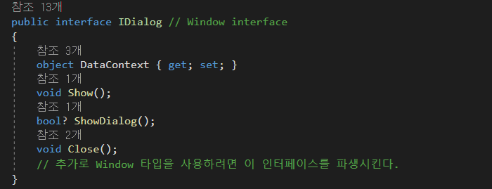

# WPF MVVM Dialog

### Introduce

이 문서에서는 MVVM 패턴을 지키려고 할 때, View 와 ViewModel 간의 분리를 위해 Window ( 또는 Dialog ) 를 컨트롤하고 조작하는 방법에 대해서 설명하려고 합니다.

일반적으로 다이얼로그는 결국 View이기때문에 ViewModel에서 직접 인스턴스를 획득하여 핸들링하는 것은 패턴 규칙에 위배되게 됩니다.

1. Interface 설명
   1. IDialog\
      
      * Window의 기능을 추상화, 따라서 위 4개의 메서드 구현체가 아니면 사용이 불가능합니다
      * IDialog를 이용해서 Window에 붙여 사용합니다
   2. IDialogContext\
      .png>)
      * 윈도우의 Context, 그러니까 윈도우 정보를 관리하기 위해 만든 Interface로 실제 내용은 없지만 reference로 가지고 있습니다.
      * 즉, Context 를 재정의 해서 reference 참조합니다.\

   3. IContext\
      .png>)
      * Context 용도로 사용하는 내용이 없는 빈 Interface 입니다.
      * IContext가 필요하진 않지만 타입 강제를 위해 사용합니다.
   4. IDialogService\
      .png>)
      * 생성한 Dialog를 관리하고 실제 기능을 호출하기 위한 Interface 입니다.
      * 형식 제한을 통해 해당 기능을 사용할 Dialog만 사용할 수 있도록 구성합니다.
      * DialogResult 를 이용해 callback을 받을 수 있습니다.
2. 구현 Class 설명
   1.  DialogService\
       .png>)

       * \_dialogTypes => View를 관리하기 위한 리스트
       * \_openedDialogs => 호출한 Dialog의 ViewModel을 저장해 두고 관리하기 위한 리스트

       .png>)

       * dialog를 종료하고 관리 리스트에서 다이얼로그를 지웁니다.
       * 호출 전 Func 매개변수를 통해 먼저 DataContext가 존재하는지 확인합니다.\
         이 구조는 Set (Show) 에서도 동일합니다.

       .png>)

       * Dialog를 보여주기 위해 동적으로 Instance를 생성하기 위하여 Activator를 생성하고 관리합니다.
       * Modal, Modeless 를 구별합니다.

### Instructions

