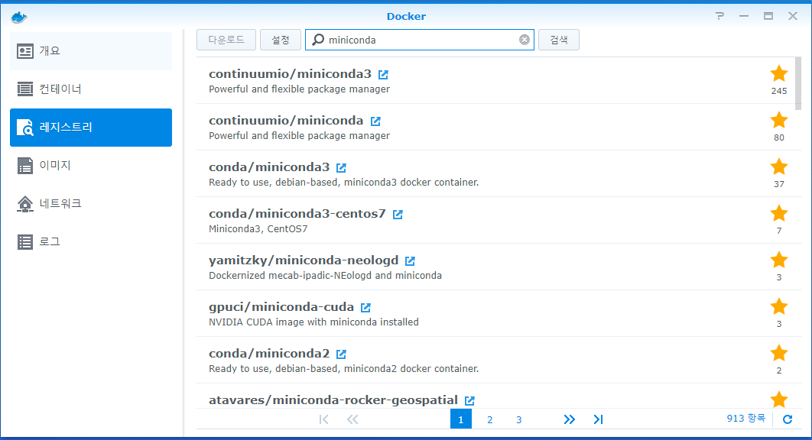

# Setup Python3 - Anaconda

아나콘다는 파이썬을 쉽고 편하게 쓸 수 있는 오픈소스 프레임워크에요.

저는 이 프레임워크를 만들고, 도커에서 어떻게 사용하는지 이야기해볼꺼에요.

## Top of all.

처음 구축을 위해서 도커를 먼저 설치해야해요. 도커 설치법은 다음에 다시 포스팅하기로 해요.  
이 글은 도커가 설치되어있는 시놀로 환경을 기준으로 작성할께요.

## Docker With  miniconda

도커 레지스트리를 먼저 받아야 해요. 저는 [continumio/miniconda3](https://registry.hub.docker.com/r/continuumio/miniconda3/) 라는 레지스트리를 사용했어요.  
설치 명령어는 다음과 같아요.

윈도우/리눅스 환경

```text
docker pull continuumio/miniconda3
```

시놀로지 환경



설치가 다 되면, 아래처럼 이미지를 실행시킬 수 있어요.


## Reference.

